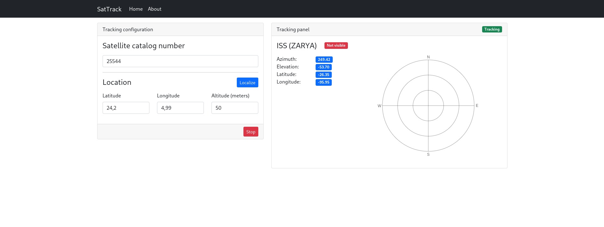

# SatTrack

Modern satellite tracking solution (currently WIP)

## TODO

### Backend

- [ ] Custom validation messages
- [ ] Check for performance issues & missing best practises
- [ ] API documentation
- [ ] Rate-limiting

### Frontend

- [ ] Migrate to Typescript
- [ ] About page
- [ ] Custom UI (Currently using Bootstrap 💀) + enhancements
- [ ] More functionalities (pass prediction, elevation/azimuth graph)
- [ ] GitHub action for ESLint

### Docker

- [ ] Dockerhub tag (currently it is only tagging with 'latest')
